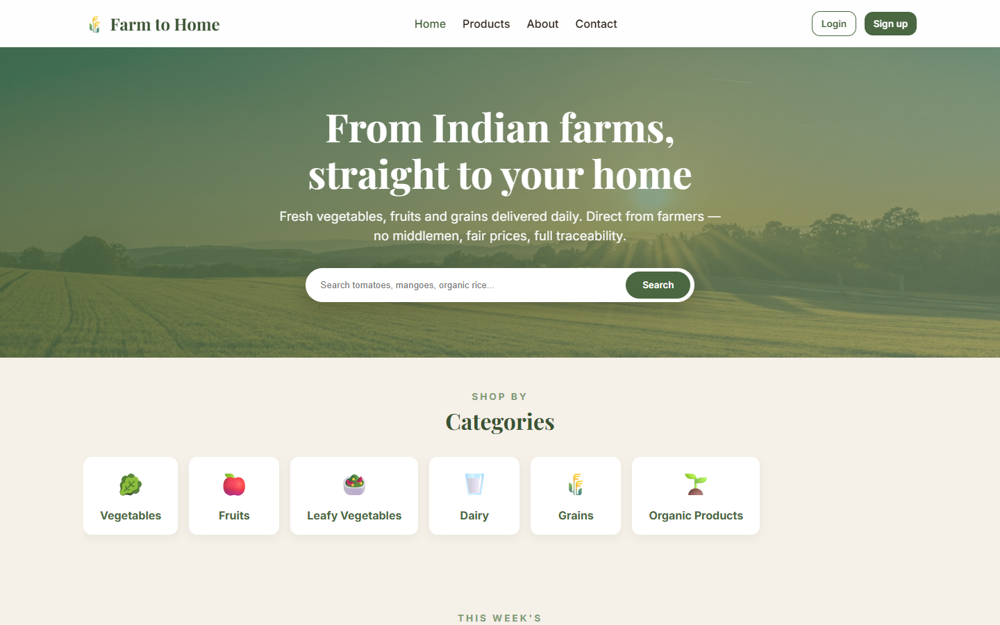
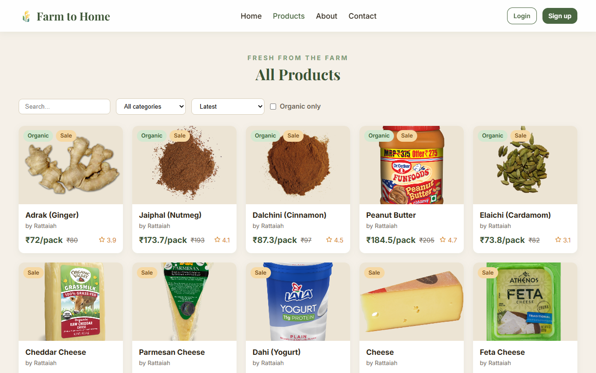
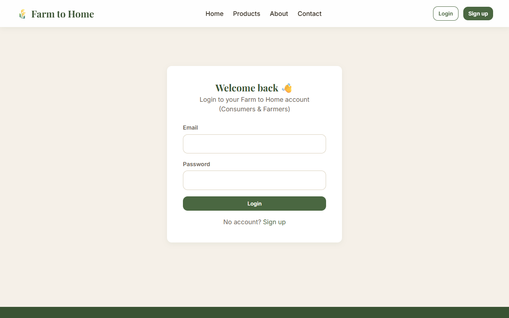
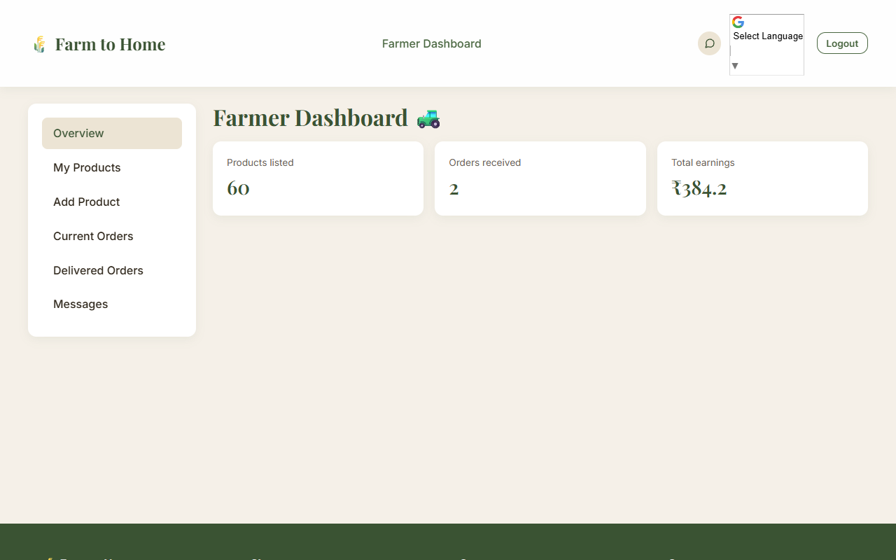
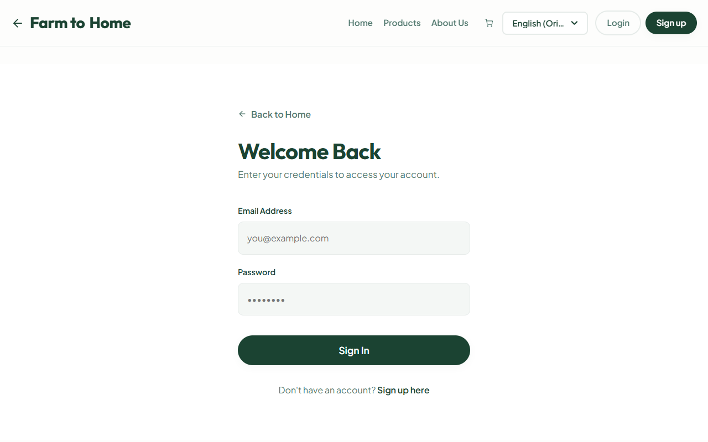

# Farm to Home Mini Project (Avishkarna Andhra Internship)

**Farm to Home** is a full-stack e-commerce web application that connects local farmers directly with consumers, eliminating middlemen and creating a transparent marketplace for fresh agricultural products. The platform enables farmers to showcase and sell their produce online while allowing consumers to purchase fresh, locally sourced, and high-quality products directly from the source.

The application is built using the MERN stack (MongoDB, Express.js, React.js, Node.js) and provides a seamless shopping experience for customers along with efficient inventory and order management tools for farmers. By fostering direct farmer-to-consumer interactions, the platform promotes fair pricing, sustainable agriculture, and stronger local farming communities.

## 🚀 Live Demo Credentials
Want to test the platform quickly without registering? Use these pre-configured demo accounts to explore different roles:

**Consumer Account (For buying products):**
* **Email:** `user@demo.com` *(or easily register your own)*
* **Password:** `password123`

**Farmer Accounts (For selling, try different ones to see specific products!):**
* **General Demo:** `farmer@demo.com`
* **Vegetables & Organics:** `rattaiah@farmer.com`
* **Fruits:** `kiran@farmer.com`
* **Dairy:** `suresh@farmer.com`
* **Password (for all farmers):** `password123`

---

## 📸 Section-by-Section Walkthrough & Screenshots

### 1. Home Page (Landing Experience)

**Explanation:** 
The Home Page serves as the welcoming storefront for the platform. It features a modern, hero-banner design introducing the Farm to Home concept. The page highlights the core value proposition: fresh, middleman-free produce. It also displays featured products categorized by "Best Sellers" or "Seasonal Freshness" to immediately engage users. A clear navigation bar allows users to quickly jump to the Products page or log in to their respective portals.

### 2. Products Marketplace (Consumer View)

**Explanation:**
This is the primary shopping interface for consumers. It presents a responsive grid layout of all available fresh produce directly sourced from registered farmers. 
* **Filtering & Search:** Users can filter products by categories (e.g., Fruits, Vegetables, Dairy) and search for specific items.
* **Product Details:** Each card displays the product image, farmer name, price per unit, and available stock.
* **Interaction:** Consumers can instantly add items to their cart or view more detailed information about the product's origin and farming practices.

### 3. Secure Authentication (Login/Register)

**Explanation:**
The platform features a secure, dual-role authentication portal. 
* **Role Selection:** Users must specify whether they are joining as a "Consumer" or a "Farmer". This is crucial because it determines the dashboard and permissions they receive after logging in.
* **Security:** The system is powered by JWT token encryption, ensuring all user data, order history, and sensitive credentials are safely protected. It features form validation and instant error feedback.

### 4. Farmer Dashboard (Management Portal)

**Explanation:**
A dedicated, secure management panel strictly accessible by verified farmers. 
* **Business Overview:** Farmers can track their total earnings, total orders, and active products at a glance.
* **Order Fulfillment:** Displays incoming orders from consumers. Farmers can update the status of these orders (Pending -> Processing -> Delivered).
* **Inventory Management:** Farmers can seamlessly add new products with images, set pricing, and update stock levels to ensure their store is always up-to-date.

### 5. FarmPass & Subscriptions

**Explanation:**
This dedicated section allows users to manage their premium features and recurring deliveries.
* **FarmPass Membership:** Users can subscribe to FarmPass for ₹499/month, immediately unlocking zero delivery fees and a flat 10% discount on all future orders.
* **Recurring Baskets:** Consumers who want daily essentials (like milk or vegetables) delivered automatically can manage their recurring product subscriptions here, viewing delivery frequencies and costs.

### 6. Dynamic Cart & Checkout

**Explanation:**
A seamless shopping cart experience that automatically calculates item subtotals, applies FarmPass discounts if applicable, and computes delivery fees. The interface allows users to adjust quantities or remove items before proceeding to a smooth, multi-step checkout process to secure their fresh produce.

### 7. Real-Time Farmer-Consumer Chat

**Explanation:**
A crucial feature for a direct-to-consumer platform. This real-time messaging system (powered by Socket.io) enables direct communication between consumers and farmers. Buyers can ask questions about the exact harvest date, organic certifications, or negotiate bulk pricing without leaving the application.

---

## 🌟 Present Project Features (Fully Implemented)

### 🧑‍🌾 Consumer (Buyer) Features
* **Smart Marketplace:** Browse and search fresh farm products with advanced filtering by categories (Vegetables, Fruits, Dairy, etc.) and search by keywords.
* **Product Details & Reviews:** View comprehensive product information, farmer details, available stock, and read real customer reviews before buying.
* **Shopping Cart & Wishlist:** Manage items in a dynamic cart with automatic subtotal calculations. Save favorite items to a personalized Wishlist for later.
* **FarmPass Subscriptions:** Premium membership offering benefits like a 10% discount on all purchases and free delivery on eligible orders.
* **Advanced Checkout System:** Seamless, multi-step checkout process with delivery fee calculations and order confirmation.
* **Complete Order Tracking:** Dedicated pages to view complete order history (`My Orders`) and track current, real-time status of active orders (`Order Details`).
* **Real-Time Direct Chat:** Built-in Socket.io messaging allowing consumers to chat *directly* with the farmers to ask about produce freshness or delivery.
* **Multilingual Support:** Integrated Google Translate to allow users to browse the marketplace in their preferred local language.

### 🚜 Farmer (Seller) Features
* **Dedicated Farmer Dashboard:** A specialized, secure management panel showing a high-level overview of total earnings, pending orders, and total products.
* **Inventory Management:** Full CRUD (Create, Read, Update, Delete) capabilities. Farmers can easily add new products, upload images, set pricing, and edit stock levels.
* **Order Processing System:** View incoming orders specifically for their products. Farmers can update the fulfillment status (Pending -> Processing -> Shipped -> Delivered) to keep customers informed.
* **Profile Management:** Farmers can manage their public profiles, ensuring customers know who is growing their food.

### 🛡️ System & Architecture Features
* **Dual-Role Authentication:** Secure user authentication using JSON Web Tokens (JWT) with strict Role-Based Access Control (RBAC) separating Consumers from Farmers.
* **Cloud Media Storage:** Direct integration with Cloudinary for secure, fast, and scalable product image uploads.
* **Real-Time Infrastructure:** Node.js backend using Socket.io to push live updates for chat and order notifications.
* **Responsive Modern UI:** Built with React.js and Vite, utilizing a mobile-first Vanilla CSS approach for incredibly fast performance and fluid animations.

---

## Technology Stack

### Frontend
* **React.js** & **Vite**
* **Custom Vanilla CSS** (Responsive and Mobile-First)

### Backend & Database
* **Node.js** & **Express.js**
* **MongoDB** & Mongoose

### Authentication & Real-Time
* **JSON Web Token (JWT)**
* **Socket.io**

---

## How to Run Locally

### 1. Database
Ensure you have MongoDB running locally, or have a MongoDB Atlas connection string ready.

### 2. Backend Setup
```bash
cd backend
npm install
```
Create a `.env` file inside the `/backend` folder:
```env
PORT=5000
MONGO_URI=mongodb://127.0.0.1:27017/farm-to-home
JWT_SECRET=your_super_secret_key
CLIENT_URL=http://localhost:5173
```
Start the backend server:
```bash
npm run dev
```

### 3. Frontend Setup
Open a new terminal window and navigate to the frontend folder:
```bash
cd frontend
npm install
```
Create a `.env` file in the `/frontend` folder:
```env
VITE_API_URL=http://localhost:5000/api
```
Run the React application:
```bash
npm run dev
```

The application will now be running at `http://localhost:5173`!

---
## Project Impact

Farm to Home creates a sustainable digital marketplace that empowers local farmers by providing direct access to consumers while ensuring fair pricing and increased profitability. Consumers benefit from access to fresh, high-quality produce, transparent sourcing information, and a convenient online shopping experience. The platform strengthens local agricultural ecosystems and promotes a more efficient farm-to-consumer supply chain.
